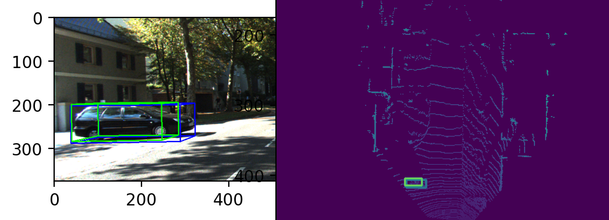

# PointPainting
Implementation of PointPainting (https://arxiv.org/abs/1911.10150), an image-lidar fusion algorithm for 3D object detection.


blue boxes are ground truth, green predicted.

Clone the repo
```
git clone https://github.com/rshilliday/painting.git
cd painting
pip install requirements.txt
```

Download and unzip the KITTI Dataset (images, lidar, labels, calib): http://www.cvlibs.net/datasets/kitti/eval_object.php?obj_benchmark=bev

Download and save weights for the semantic segmentation network: https://drive.google.com/file/d/1nqSDmTx97Y23j7L3Wca5hPudxXp57A7J/view?usp=sharing

Train and evaluate the network:
```
python train.py
python eval.py
```

##To Do:
[ ] Add data augmentation
[ ] Add Focal Loss
